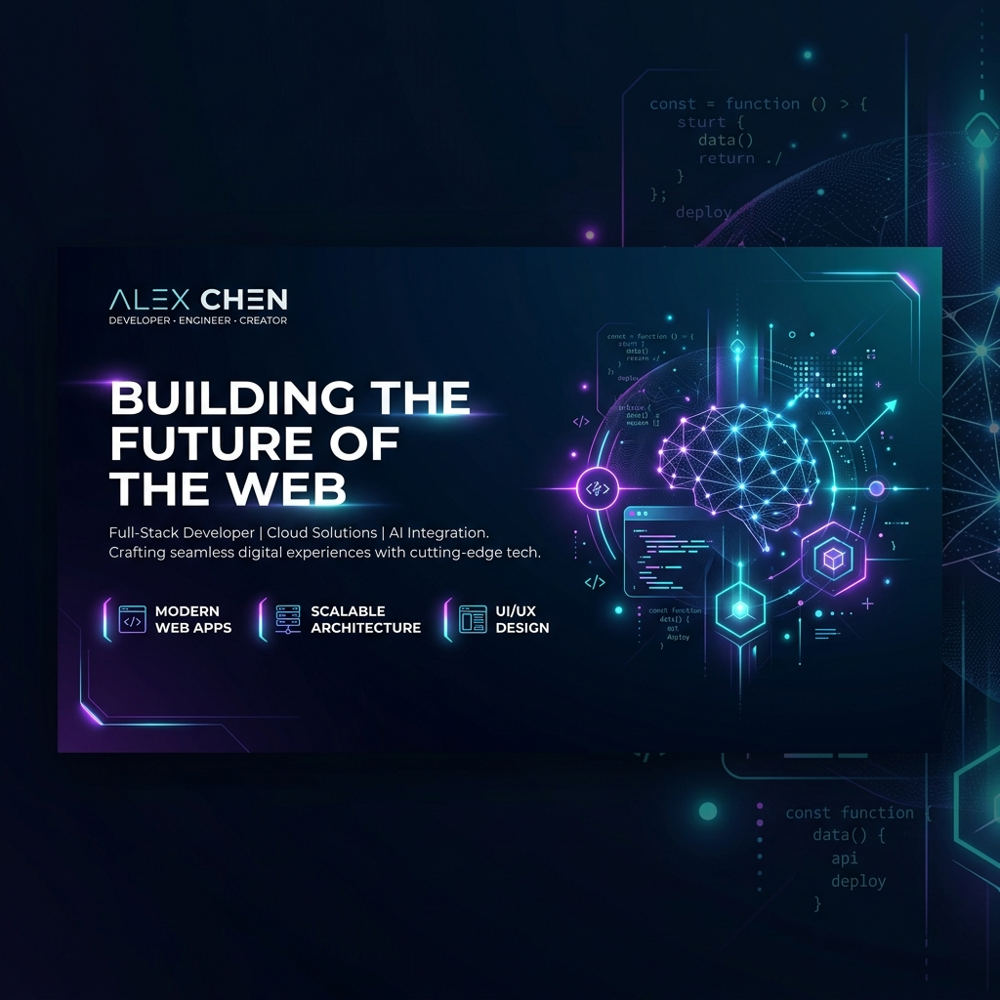

<!-- Beautiful custom hero banner generated by AI -->

  

<!-- Typing SVG for stunning dynamic header -->
<h1 align="center">
  
</h1>

  
  

---

### 💫 About Me

I am a passionate **Fullstack Web Developer** and technology enthusiast with a deep love for building robust systems and crafting rich, responsive user experiences.

- 🔭 Currently working on building advanced web solutions at **[cxview.ai](https://cxview.ai/)**, focusing heavily on **JavaScript/TypeScript**, **Python**, and **.NET**.
- 🛠️ Boast about **more than 2 years of experience** developing robust web services, API integrations, and cross-platform mobile apps with **Flutter**, alongside configuring **Ubuntu servers** and managing Linux systems.
- 🚀 Constantly learning, adapting, and growing with each line of code I write.

---

### 💻 Tech Stack

| **Frontend** |  |
| **Backend & DB** |  |
| **Tools & DevOps** |  |

---

### 📊 GitHub Analytics

<!-- Dynamic Widescreen Contribution Activity Graph -->

  

<!-- Sleek Gamified Animated Snake Contribution Game -->

  <picture>
    <source media="(prefers-color-scheme: dark)" srcset="https://raw.githubusercontent.com/phanhuyhiep/phanhuyhiep/output/github-contribution-grid-snake-dark.svg" />
    <source media="(prefers-color-scheme: light)" srcset="https://raw.githubusercontent.com/phanhuyhiep/phanhuyhiep/output/github-contribution-grid-snake.svg" />
    
  </picture>

<!-- Contribution Streak Tracker -->

  

---

### 🌱 Currently Exploring & Improving

- ⚡ **Advanced Full Stack & Mobile Architectures**: Deepening knowledge of state management patterns (Redux Toolkit) in **React** and crafting beautiful cross-platform mobile experiences with **Flutter**.
- ⚙️ **High-Performance APIs**: Scaling asynchronous systems using **FastAPI (Python)** and architecting robust enterprise solutions using **C# / .NET**.
- 📊 **Scalable Databases**: Fine-tuning query performance, database normalization, and index configurations in **PostgreSQL**, **MySQL**, and **MongoDB**.
- 🛠️ Check out all my repositories and project sources at [Repositories](https://github.com/phanhuyhiep?tab=repositories).

---

  <i>Thanks for stopping by! Let's connect, share ideas, and build the future together. 🚀</i>

